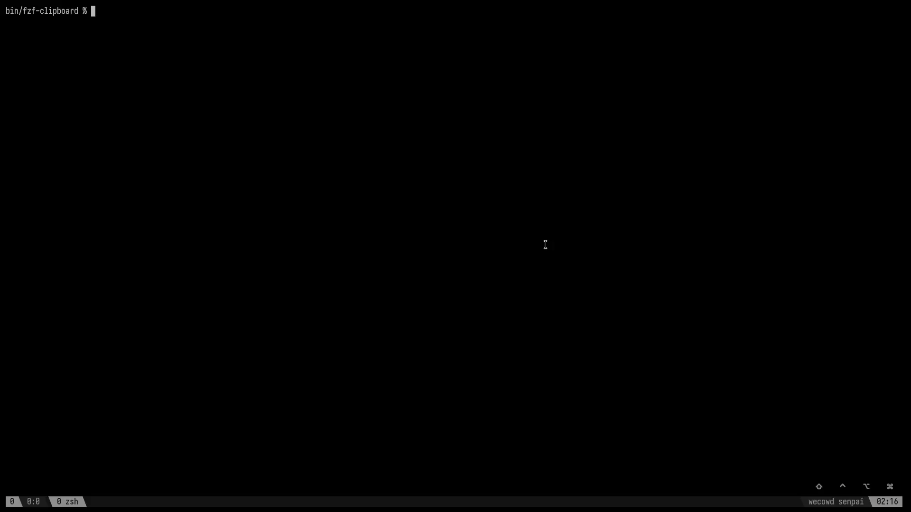

### fzf-clipboard



Do a fzf search on your clipboard history and copy what you select.

```bash
# clone the repo to a target dir
git clone https://github.com/dorukozerr/fzf-clipboard.git ~/somepath/somefolder

# update your shell config to source file
source "$HOME/somepath/somefolder/fzf-clipboard.zsh"
```

keybinding configured is `ctrl + y`, you can update `fzf-clipboard.zsh` file to change the keybinding

tested on macos & zsh only
